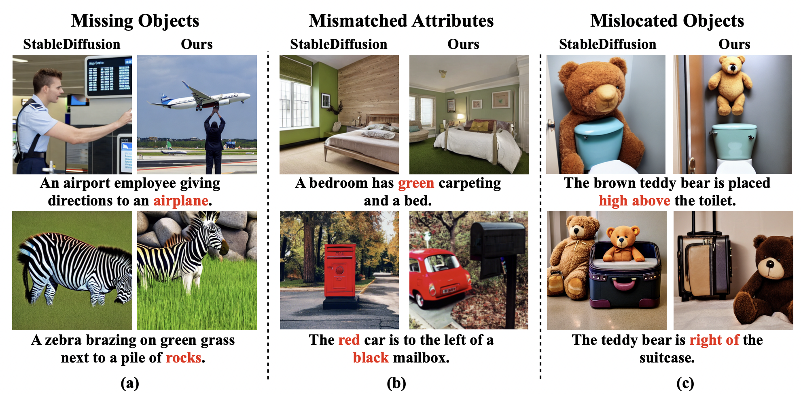
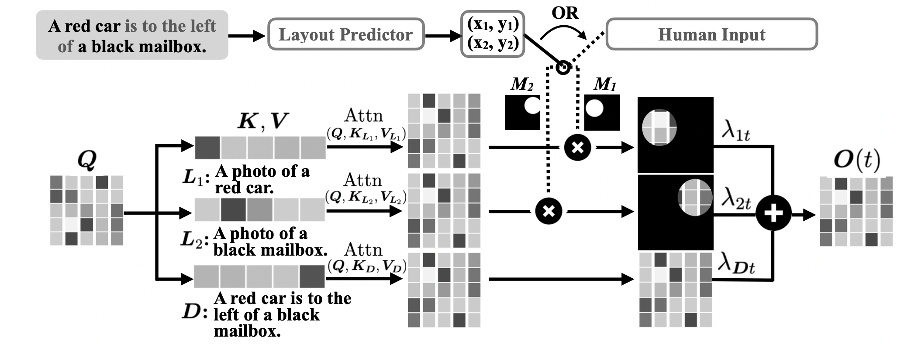

# Harnessing the Spatial-Temporal Attention of Diffusion Models for High-Fidelity Text-to-Image Synthesis

[Qiucheng Wu](https://wuqiuche.github.io/)<sup>1</sup>\*,
[Yujian Liu](https://yujianll.github.io)<sup>1</sup>\*,
[Handong Zhao](https://hdzhao.github.io)<sup>2</sup>,
[Trung Bui](https://sites.google.com/site/trungbuistanford/)<sup>2</sup>,
[Zhe Lin](https://research.adobe.com/person/zhe-lin/)<sup>2</sup>,
[Yang Zhang](https://mitibmwatsonailab.mit.edu/people/yang-zhang/)<sup>3</sup>,
[Shiyu Chang](https://code-terminator.github.io/)<sup>1</sup>
<br>
<sup>1</sup>UC, Santa Barbara, <sup>2</sup>Adobe Research, <sup>3</sup>MIT-IBM Watson AI Lab

\*denotes equal contribution.

This is the official implementation of the paper "Harnessing the Spatial-Temporal Attention of Diffusion Models for High-Fidelity Text-to-Image Synthesis".

## Overview

Diffusion-based models have achieved state-of-the-art performance on text-to-image synthesis tasks. However, one critical limitation of these models is the low fidelity of generated images with respect to the text description, such as missing objects, mismatched attributes, and mislocated objects. One key reason for such inconsistencies is the inaccurate cross-attention to text in both the spatial dimension, which controls at what pixel region an object should appear, and the temporal dimension, which controls how different levels of details are added through the denoising steps. In this paper, we propose a new text-to-image algorithm that adds explicit control over spatial-temporal cross-attention in diffusion models. We first utilize a layout predictor to predict the pixel regions for objects mentioned in the text. We then impose spatial attention control by combining the attention over the entire text description and that over the local description of the particular object in the corresponding pixel region of that object. The temporal attention control is further added by allowing the combination weights to change at each denoising step, and the combination weights are optimized to ensure high fidelity between the image and the text. Experiments show that our method generates images with higher fidelity compared to diffusion-model-based baselines without fine-tuning the diffusion model.



## The workflow
Here, we demonstrate our text-to-image generation pipeline at one denoising step. Given input text $\boldsymbol{D}$, we first parse it and extract all objects mentioned, constructing local descriptions $\boldsymbol{L}_{i}$. Next, the layout predictor predicts the pixel region for each object in the text. The diffusion model attends to the global description $\boldsymbol{D}$ and additionally attends to the local description in the object's region. The final attention output is a weighted combination of attention to both global and local descriptions, where the combination weights sum up to 1 for each pixel and are optimized for each denoising step to achieve a high fidelity with $\boldsymbol{D}$.



## Requirements
Our code is based on <a href="https://github.com/CompVis/stable-diffusion">stable-diffusion</a>. This project requires one GPU with around 48GB memory. Please first clone the repository and build the environment:
```bash
git clone https://github.com/UCSB-NLP-Chang/Diffusion-SpaceTime-Attn
cd Diffusion-SpaceTime-Attn/attention_optimization/stable-diffusion
bash environment-prepare.sh
conda activate ldm
cd ../../
```
You will also need to download the pretrained stable-diffusion model:
```bash
mkdir -p attention_optimization/stable-diffusion/models/ldm/stable-diffusion-v1
cd attention_optimization/stable-diffusion
wget -O models/ldm/stable-diffusion-v1/model.ckpt https://huggingface.co/CompVis/stable-diffusion-v-1-4-original/resolve/main/sd-v1-4.ckpt
```

## Run the Layout Predictor
To train the layout predictor, first download <a href="https://cocodataset.org/#download">training data</a> from MSCOCO (2017 Train/Val annotations [241MB] and 2017 Stuff Train/Val annotations [1.1GB]). Extract the annotations to ```data/coco/annotations```.

Training code:
```bash
cd layout_predictor/LayoutTransformer
python train.py --cfg_path ./configs/coco/coco_seq2seq_v9_ablation_4.yaml
```
We provide a pretrained model <a href="https://drive.google.com/file/d/147UdbmtAgnB1tjglvxljXVn_OxswuY1f/view?usp=sharing">here</a>. Extract the model to ```saved/coco_F_seq2seq_v9_ablation_4/```.

Inference code:
```bash
python inference/inference_coco.py --sentence 'The silver bed was situated to the right of the white couch.'
```
The output will be similar to the following:
```bash
Sentence: The silver bed was situated to the right of the white couch.
The silver bed position: (0.574, 0.503)
the white couch position: (0.269, 0.442)
```
This means the predicted coordinates of bed and couch are (0.574, 0.503) and (0.269, 0.442) respectively.

## Run the whole pipeline (3 datasets)
### GPT-Synthetic Dataset
The dataset can be found in ```datasets/gpt.txt```. As introduced in paper, this dataset is created by querying Chat-GPT. Please refer to the paper for more details.

To run on this dataset:
```bash
cd attention_optimization/stable-diffusion
python scripts/txt2img-gpt.py --plms --ddim_steps 50 --prompt ""
```

### MS-COCO Dataset
The dataset can be found in ```datasets/mscoco.txt```. As introduced in paper, this dataset is from MS-COCO's caption. Please refer to the paper for more details.

To run on this dataset:
```bash
cd attention_optimization/stable-diffusion
python scripts/txt2img-mscoco.py --plms --ddim_steps 50 --prompt ""
```

### VSR Dataset
The dataset can be found in ```datasets/vsr.txt```. As introduced in paper, this dataset is from VSR's caption. Please refer to the paper for more details.

To run on this dataset:
```bash
cd attention_optimization/stable-diffusion
python scripts/txt2img-vsr.py --plms --ddim_steps 50 --prompt ""
```

You can find the generated images in ```result_outputs/```.


## Evaluation (3 datasets)
First, we need to install environment for the object detector. This step exactly follows the detrex official documentation (https://detrex.readthedocs.io/en/latest/tutorials/Installation.html):
```bash
cd attention_optimization/stable-diffusion
bash environment-prepare-detrex1.sh
```

We are aware that some users may encouter nvcc/cudatoolkit errors when following the above instruction. In that case, please follow instructions below.
```bash
cd attention_optimization/stable-diffusion
git clone https://github.com/IDEA-Research/detrex.git
cd detrex
git submodule init
git submodule update
conda create -n detrex python=3.9 -y
conda activate detrex
conda install pytorch==1.11.0 torchvision==0.12.0 torchaudio==0.11.0 cudatoolkit=11.3 -c pytorch -y
conda install -c "nvidia/label/cuda-11.3.0" cuda-nvcc -y
conda install cudatoolkit-dev=11.3 -c conda-forge -y
export PATH=/home/user/miniconda3/envs/detrex/bin/:$PATH
export CUDA_HOME=/home/user/miniconda3/envs/detrex/
export LD_LIBRARY_PATH="/home/user/miniconda3/envs/detrex/lib"
python -m pip install -e detectron2 
pip install -e .
wget https://github.com/IDEA-Research/detrex-storage/releases/download/v0.2.0/dino_swin_large_384_4scale_36ep.pth 
```

Then you can evaluate result. Put ```attention_optimization/stable-diffusion/evaluation/*``` into ```attention_optimization/stable-diffusion/detrex/demo/```.
```bash
cd attention_optimization/stable-diffusion/detrex/demo/
CUDA_VISIBLE_DEVICES=1 python detector_result_gpt.py
CUDA_VISIBLE_DEVICES=1 python relation_result_gpt.py
```

## Results
We demonstrate examples of generated images by our method and baselines below. Typical errors of baselines include missing objects, mismatched attributes, and mislocated objects. Ours (1)/(2) show the results with two different random seeds.


## Parent Repository
This code is adopted from <a href="">https://github.com/CompVis/stable-diffusion</a>, <a href="">https://github.com/davidhalladay/LayoutTransformer</a>, and <a href="">https://github.com/orpatashnik/StyleCLIP</a>.

